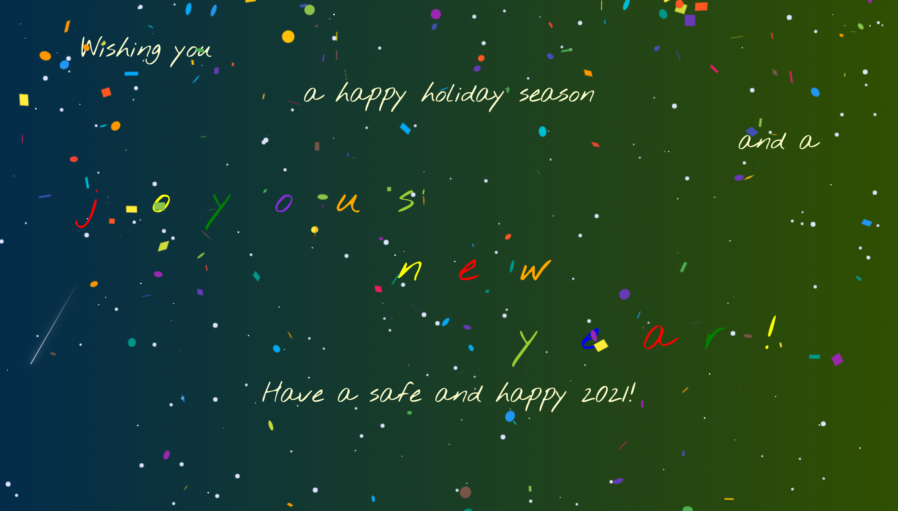

# Happy Holidays 2020

  ## Table of Contents

  * [Description](#description)
  * [Screenshot](#screenshot)
  * [Installation](#installation)
  * [Usage](#usage)
  * [Technologies Used](#technologies)
  * [Tests](#tests)
  * [Credits](#credits)
  * [Contributing](#contributing)
  * [Questions](#questions)
  * [License](#license)

  ## Description

  This is a simple little React-based "Happy Holidays" animation using the Twinkling Night Sky animation by Sharna Hossain,react-simple-animate, react-bootstrap, react-confetti, and react-snowfall.

  ## Screenshot

  Happy Holidays:
  

  ## Installation Instructions

  npm install

  ## Usage

  This project is intended to be used to wish you "happy holidays."

  ## Technologies Used

  Node.js, React, react-simple-animate, React-Bootstrap, react-confetti, react-snowfall

  ## Tests

  npm run test

  ## Credits

  Twinkling Night Sky animation by Sharna Hossain can be found on CodePen [here](https://codepen-staging.com/sharnajh/pen/WNvppRy)

  ## Contributing

  N/A

  ## Questions

  If you have further questions, you can reach me at lauracole1900@comcast.net. For more of my work, see [my GitHub](https://github.com/LauraCole1900).

  ## License

  .
